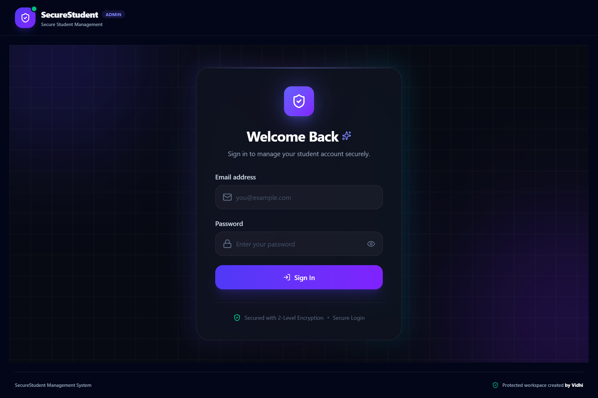
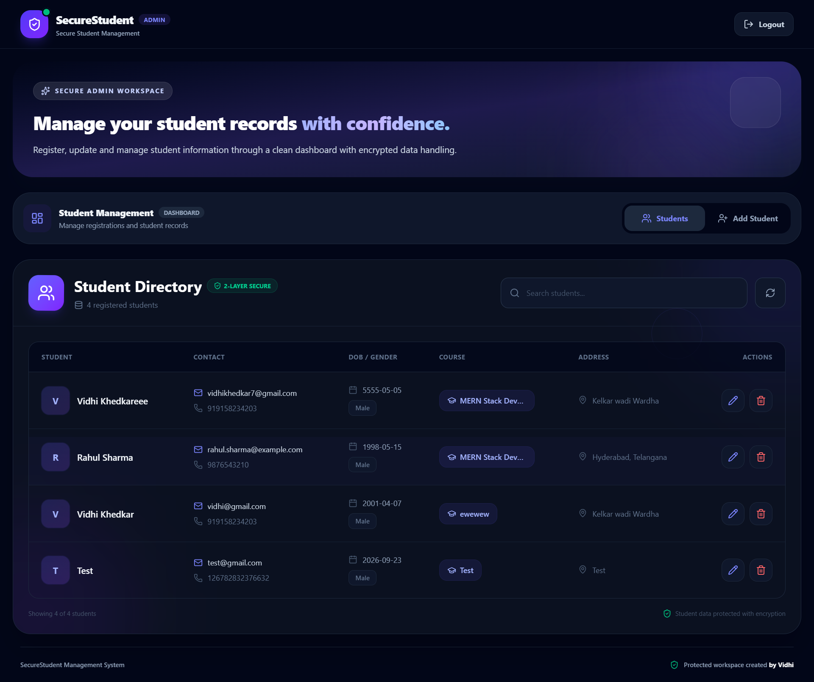
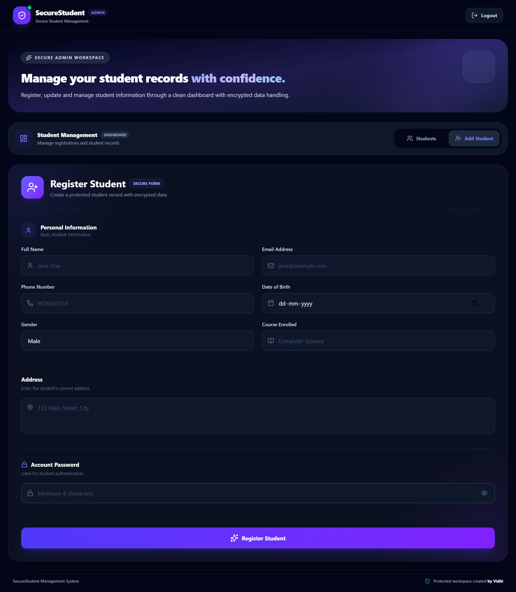
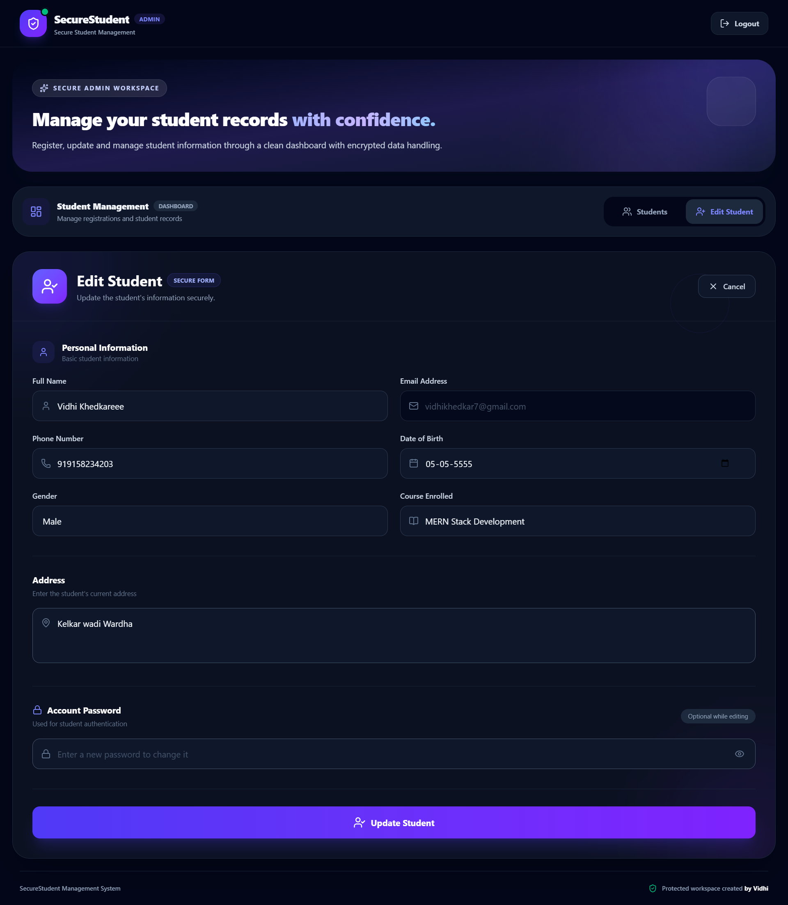

#  Secure Student Management System

A full-stack Student Management System built using **React.js, Node.js, Express.js, and MongoDB**, featuring a **two-level AES encryption mechanism** for protecting student data during transmission and storage.

##  Features

* Student registration
* Student login
* View all registered students
* Edit student information
* Delete student records
* RESTful APIs using Node.js and Express.js
* MongoDB database integration
* Two-level AES encryption
* Responsive React.js UI
* Frontend and backend separated into independent applications
* Environment-based configuration using `.env`
* Secure authentication and protected student management workflow

---

#  Project Structure

```text
task-react-node-javascript/
│
├── client/
│   ├── src/
│   │   ├── components/
│   │   │   ├── LoginForm.jsx
│   │   │   ├── StudentForm.jsx
│   │   │   └── StudentList.jsx
│   │   ├── utils/
│   │   │   └── crypto.js
│   │   ├── App.jsx
│   │   └── main.jsx
│   ├── package.json
│   └── vite.config.js
│
├── server/
│   ├── src/
│   │   ├── routes/
│   │   │   └── studentRoutes.js
│   │   ├── controllers/
│   │   │   └── studentController.js
│   │   ├── models/
│   │   │   └── Student.js
│   │   ├── utils/
│   │   │   └── crypto.js
│   │   ├── app.js
│   │   └── server.js
│   └── package.json
│
├── screenshots/
│   ├── login_page.png
│   ├── Student_Dashboard.png
│   ├── Student_Registration.png
│   └── Edit-Student.png
│
├── .gitignore
├── README.md
└── ...
```

---

#  Tech Stack

## Frontend

* React.js
* JavaScript (ES6+)
* Vite
* Tailwind CSS
* Axios
* CryptoJS
* Framer Motion

## Backend

* Node.js
* Express.js
* JavaScript
* Mongoose
* CryptoJS
* CORS
* dotenv

## Database

* MongoDB
* MongoDB Atlas

## Development & Deployment

* Git
* GitHub
* VS Code
* Render

---

#  Setup Instructions

## 1. Clone the Repository

```bash
git clone https://github.com/YOUR_USERNAME/task-react-node-javascript.git
cd task-react-node-javascript
```

---

#  Backend Setup

Open a terminal and navigate to the server folder:

```bash
cd server
npm install
```

Create a `.env` file inside the `server` folder:

```env
PORT=8080

MONGO_URI=your_mongodb_connection_string

FRONTEND_SECRET_KEY=your_frontend_encryption_key

BACKEND_SECRET_KEY=your_backend_encryption_key
```

### Start the Backend

```bash
npm start
```

The backend will run on:

```text
http://localhost:8080
```

### Health Check

Open:

```text
http://localhost:8080/health
```

A successful response confirms that the backend server is running.

---

#  Frontend Setup

Open another terminal:

```bash
cd client
npm install
```

Create a `.env` file inside the `client` folder:

```env
VITE_API_URL=http://localhost:8080/api

VITE_FRONTEND_SECRET_KEY=your_frontend_encryption_key
```

The value of:

```env
VITE_FRONTEND_SECRET_KEY
```

must match:

```env
FRONTEND_SECRET_KEY
```

configured in the backend.

### Start the Frontend

```bash
npm run dev
```

The application will normally be available at:

```text
http://localhost:5173
```

---

#  Environment Variables

For security reasons, actual `.env` files should **not be committed to GitHub**.

The repository should contain `.env.example` files instead.

### `server/.env.example`

```env
PORT=8080
MONGO_URI=your_mongodb_connection_string
FRONTEND_SECRET_KEY=your_frontend_encryption_key
BACKEND_SECRET_KEY=your_backend_encryption_key
```

### `client/.env.example`

```env
VITE_API_URL=http://localhost:8080/api
VITE_FRONTEND_SECRET_KEY=your_frontend_encryption_key
```

Create your actual `.env` files locally using these examples.

---

#  How Encryption Is Implemented

This project demonstrates a **two-level AES encryption flow**.

The purpose is to demonstrate encryption at both the frontend and backend layers before data is stored in MongoDB.

## Encryption Flow

```text
User enters student information
             ↓
       React Frontend
             ↓
       AES Encryption
          Layer 1
             ↓
        HTTP / API
             ↓
     Node.js + Express
             ↓
       AES Encryption
          Layer 2
             ↓
          MongoDB
```

The sensitive student data is therefore protected by two encryption layers before being stored in the database.

---

## Layer 1 — Frontend Encryption

Before sending sensitive student information to the backend, the React application encrypts the required fields using AES.

Example:

```js
const encryptedData = CryptoJS.AES.encrypt(
  data,
  SECRET_KEY
).toString();
```

The frontend encryption key is configured using:

```env
VITE_FRONTEND_SECRET_KEY=your_frontend_encryption_key
```

---

## Layer 2 — Backend Encryption

When the encrypted data reaches the Node.js backend, the backend applies a second AES encryption layer using a separate backend key.

```js
const encryptedData = CryptoJS.AES.encrypt(
  data,
  BACKEND_SECRET_KEY
).toString();
```

The backend key is stored in:

```env
BACKEND_SECRET_KEY=your_backend_encryption_key
```

The backend encryption key is **different from the frontend encryption key**.

---

#  Decryption Flow

When student information is requested:

```text
MongoDB
   ↓
Backend decrypts Layer 2
   ↓
Frontend receives Layer 1 encrypted data
   ↓
Frontend decrypts Layer 1
   ↓
Readable student information
```

The backend first removes its own encryption layer.

The frontend then decrypts the remaining frontend encryption layer before displaying the student information.

---

#  Login Flow

The login process follows this flow:

```text
User enters Email + Password
             ↓
Frontend encrypts password
             ↓
Backend receives login request
             ↓
Backend finds student by email
             ↓
Backend decrypts stored Layer 2
             ↓
Stored Layer 1 password is decrypted
             ↓
Incoming password is decrypted
             ↓
Plaintext passwords are compared
             ↓
Login successful / rejected
```

> **Assignment Note:** AES is used for the password because the assignment specifically requires AES encryption. In a production authentication system, passwords should normally be stored using a one-way password hashing algorithm such as **bcrypt or Argon2**, rather than reversible encryption.

---

#  API Endpoints

| Method | Endpoint           | Description            |
| ------ | ------------------ | ---------------------- |
| POST   | `/api/register`    | Register a new student |
| POST   | `/api/login`       | Login student          |
| GET    | `/api/students`    | Get all students       |
| PUT    | `/api/student/:id` | Update student         |
| DELETE | `/api/student/:id` | Delete student         |

---

#  Student Registration Fields

The registration form contains:

* Full Name
* Email
* Phone Number
* Date of Birth
* Gender
* Address
* Course Enrolled
* Password

---

#  Screenshots

##  Login

<p align="center">
  
</p>

##  Dashboard

<p align="center">
  
</p>

##  Student Registration

<p align="center">
  
</p>

##  Student Edit Form

<p align="center">
  
</p>

---


#  Author

**Vidhi Khedkar**

MERN Stack Developer
